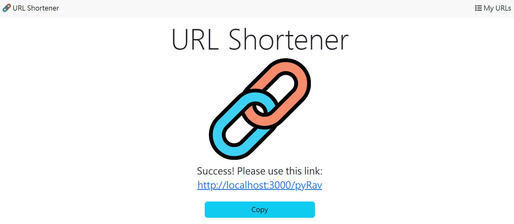
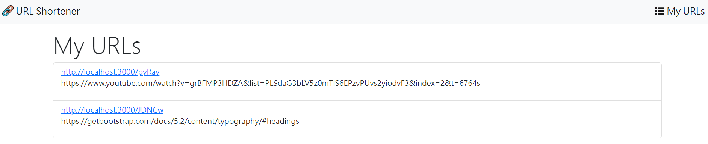

# URL Shortener




## Introduction

An URL shortener which can shorten your URLs.

## Features

- Just input an URL and press Shorten button then you will get a short URL.
- The shortened URL can be copied by Copy button.
- Press the shortened URL then you can be redirected to the original URL.

## How to Use

1. Pls make sure you have installed Node.js and npm
2. Clone the project to your local directory.
3. Access the project directory through terminal, then type in:

   ```bash
   npm install
   ```

4. Set environment variable for MongoDB

   ```
   set MONGODB_URI="Your MongoDB connection string" // for Windows cmd
   export MONGODB_URI="Your MongoDB connection string" // for bash (MacOS bash terminal and Git bash for Windows)
   ```

5. Start the project:

   ```bash
   npm run start
   ```

6. If you see the message as below, then open your browser and enter the URL.

   ```
   URL Shortener is running on http://localhost:3000
   mongodb connected!
   ```

7. To stop the server:

   ```bash
   ctrl + c
   ```

## Development tools

- Node.js 16.16.0
- Express 4.18.2
- Mongoose 6.7.0
- Express-Handlebars 4.0.2
- Bootstrap 5.2.2
- Font-awesome 6.2.0

## Developer

Wei Lin
